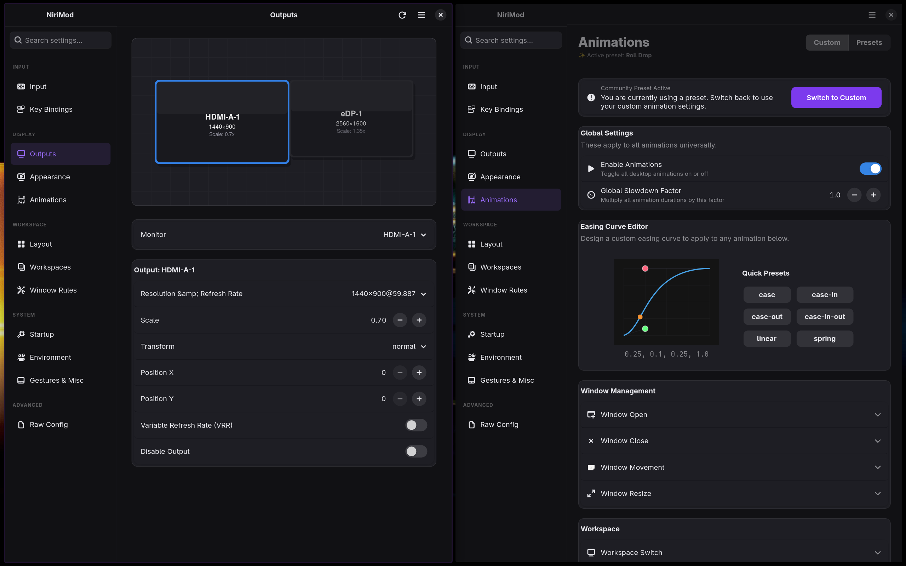
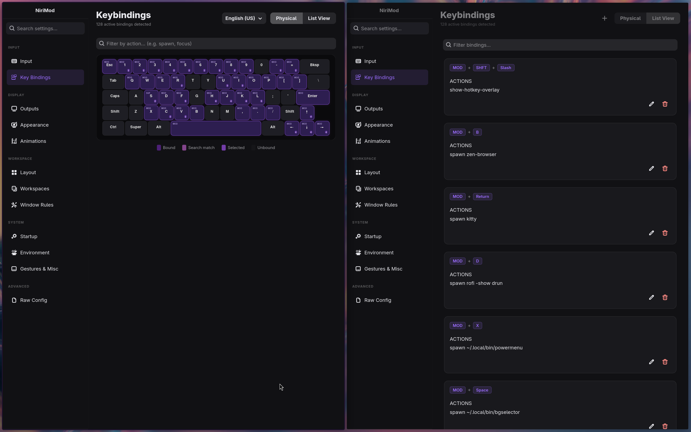
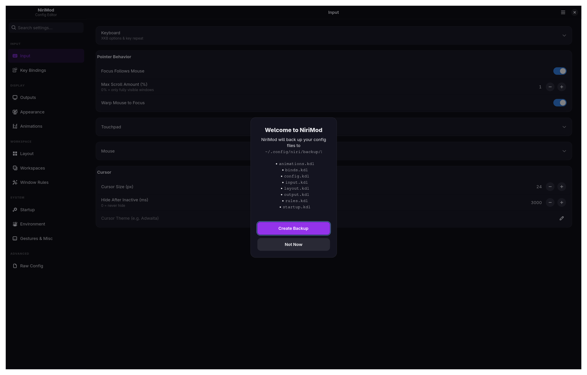

<div align="center">
  <h1>NiriMod</h1>
  
  **GTK4/libadwaita configuration editor for the [niri](https://github.com/niri-wm/niri) Wayland compositor.**

  [](LICENSE)
  [](https://python.org)
  [](https://gtk.org)
  [](https://wayland.freedesktop.org)
</div>

<br>



Niri uses KDL for configuration. Hand-editing works well for basic keys, but managing multi-monitor layouts, easing curves, and complex window rules directly in text is error-prone. NiriMod provides a native graphical interface for these subsystems while preserving existing comments, file structures, and manual edits.

## Features

- Drag-and-drop monitor layout arrangement, resolution, refresh rate, variable refresh rate (VRR), and fractional scaling.
- Interactive keyboard heat map and searchable shortcut table with duplicate conflict detection.
- Column widths, gaps, struts, and per-window matching criteria.
- Mouse, touchpad, and trackpoint settings (acceleration profiles, scroll methods, button bindings, left-handed mode).
- Cubic-bezier and spring curve editor with live previews across all compositor transitions.
- Built-in KDL editor with syntax validation and undo/redo history.



## Configuration Safety

- Writes run through `niri validate` before committing to disk. Invalid configurations are blocked and surfaced with compiler diagnostics.
- Config updates are staged in temporary files before replacing targets, preventing half-written files.
- Custom comments, whitespace, and formatting are preserved across round-trips.
- Snapshot and restore alternate configurations on demand.

### Multi-File and Desktop Shell Setups



Niri configurations frequently use `include` directives to separate concerns across files (such as inputs, outputs, or third-party shells like Dank Material Shell and Noctalia).

NiriMod resolves `include` paths recursively up to five levels deep. When modifying a setting from the interface, NiriMod maps the node back to its originating file and writes only to that file. Unrecognized directives and custom shell blocks remain untouched.

## NixOS and Home Manager

When managing Niri via Home Manager, point NiriMod directly to your source files by using out-of-store symlinks:

```nix
xdg.configFile."niri/config.kdl".source = config.lib.file.mkOutOfStoreSymlink "${config.home.homeDirectory}/path/to/your/dotfiles/niri/config.kdl";
```

NiriMod resolves symlinks to their underlying target before writing, allowing GUI adjustments to commit directly into your dotfiles repository.

## Installation

### Arch Linux (AUR)

```bash
yay -S nirimod-git
```

### Installation Script

```bash
curl -sSL https://raw.githubusercontent.com/srinivasr/nirimod/main/install.sh | bash
```

Use `--install` for non-interactive installs, `--uninstall` to remove, or `--skip-deps` to bypass package manager checks.

## Dependencies

- Python 3.12+ and `uv`
- GTK4, libadwaita, PyGObject, and Pycairo
- `niri` compositor binary

**Gentoo** (with [GURU overlay](https://wiki.gentoo.org/wiki/Project:GURU)):

```bash
emerge dev-vcs/git net-misc/curl dev-lang/python gui-libs/gtk gui-libs/libadwaita dev-python/pygobject dev-python/pycairo x11-libs/libxkbcommon x11-misc/xkeyboard-config
curl -sSL https://raw.githubusercontent.com/srinivasr/nirimod/main/install.sh | bash -s -- --install --skip-deps
```

## Contributing

Review [CONTRIBUTING.md](CONTRIBUTING.md) for local development setup and style expectations.

<a href="https://www.star-history.com/?repos=srinivasr%2Fnirimod&type=date&legend=top-left">
 <picture>
   <source media="(prefers-color-scheme: dark)" srcset="https://api.star-history.com/chart?repos=srinivasr/nirimod&type=date&theme=dark&legend=top-left" />
   <source media="(prefers-color-scheme: light)" srcset="https://api.star-history.com/chart?repos=srinivasr/nirimod&type=date&legend=top-left" />
   
 </picture>
</a>

*NiriMod is an independent project and is not affiliated with the official niri team.*
